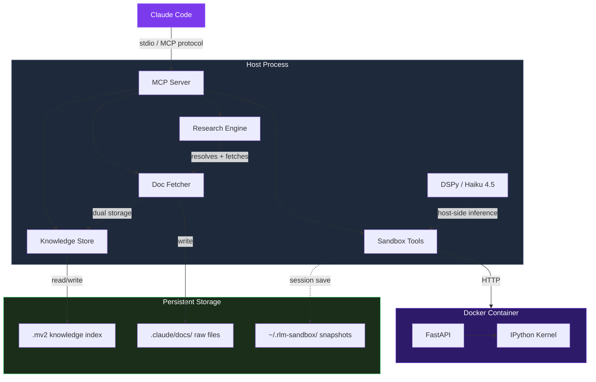
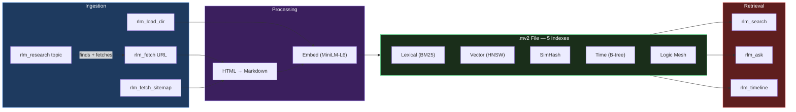

# rlm-sandbox

[](LICENSE)
[]()
[]()

Research pipeline for Claude Code. One command turns any topic into agent expertise — without blowing your context window.

```
> /research "SwiftUI NavigationStack in iOS 17+ with programmatic navigation"

Research complete: swiftui-navigationstack
- Sources: 14 fetched, 12 indexed
- Expertise: ~/.claude/research/swiftui-navigationstack/expertise.md (3.2K tokens)
- Skill generated: ~/.claude/skills/swiftui-navigationstack/SKILL.md
- Deep-dive: rlm_search(query="...", project="swiftui-navigationstack")
```

## Why this exists

We built rlm-sandbox as a Docker sandbox for running Python and testing whether a REPL-based approach to recursive language model programs could work. It worked, but the project was missing a clear purpose — a bag of tools without a workflow.

At the same time, we had a separate `/research` skill that was supposed to help Claude learn new topics. It was doing fetch-and-hope: search Google, grab some pages, dump them in a knowledge store, and cross your fingers.

Neither tool was solving the real problem: how do you make an AI agent actually *know* a topic the way a developer knows a topic? Not "I have some indexed docs I can search." Real working knowledge — the kind where you understand the mental model, know the common patterns, and can warn about the gotchas before someone hits them.

So we combined them. The sandbox REPL handles the heavy data processing (fetching, indexing, querying) without burning context tokens. The research methodology structures what to look for. The distillation step turns raw indexed content into a compact expertise artifact. The agent reads 10-15K tokens of targeted excerpts instead of 500K of raw docs.

The result is a research pipeline that vibe coders can use: `/research <topic>` and your agent becomes the expert. The RLM REPL theory still gets tested — the sandbox runs all the programmatic knowledge store queries during distillation. But now it has a reason to exist.

## Table of Contents

- [How the pipeline works](#how-the-pipeline-works)
- [Install](#install)
- [Quick start](#quick-start)
- [What it generates](#what-it-generates)
- [Tools (21 total)](#tools-21-total)
- [Architecture](#architecture)
- [Knowledge store](#knowledge-store)
- [Sandbox](#sandbox)
- [Configuration](#configuration)
- [Contributing](#contributing)
- [License](#license)

## How the pipeline works

```
/research "WebTransport protocol"
         │
         ▼
  ┌─────────────────────────┐
  │ 1. Parse input           │  Topic, URLs, context — any format
  │ 2. Build question tree   │  4-7 branches: what/how/API/gotchas/...
  │ 3. Discover sources      │  Targeted search per branch, quality-ranked
  │ 4. Fetch to disk         │  curl → markdown → .mv2 (zero context cost)
  │ 5. Distill               │  Query .mv2 per branch → expertise.md
  │ 6. Generate artifacts    │  Skill and/or subagent from expertise
  └─────────────────────────┘
         │
         ▼
  Agent now knows the topic.
  Knowledge store available for deep-dives.
```

The input is flexible. A topic name, a paragraph of context, specific URLs, or a mix of all three. The pipeline figures out what to search for based on a question tree — not blind keyword searches.

Content never enters the agent's context window during fetch. Pages go to disk, then into a `.mv2` knowledge store. The agent only reads targeted excerpts during the distillation phase.

## Install

```
/plugin marketplace add shihwesley/shihwesley-plugins
/plugin install rlm-sandbox@shihwesley-plugins
```

First run creates a Python venv and installs dependencies automatically.

Docker is optional — the research pipeline and knowledge tools work without it. Sandbox execution tools need Docker.

<details>
<summary>Manual setup (without plugin install)</summary>

```bash
git clone https://github.com/shihwesley/rlm-sandbox.git
cd rlm-sandbox
./scripts/setup.sh

# Start MCP server directly (stdio transport)
./scripts/start-server.sh

# Optional: build Docker sandbox image
docker compose up -d --build
```

</details>

## Quick start

After installing, restart Claude Code. The MCP server loads with 21 tools.

**Research a topic (the main workflow):**

```
> /research fastapi

Research complete: fastapi
- Sources: 14 fetched, 12 indexed
- Expertise: ~/.claude/research/fastapi/expertise.md (4.1K tokens)
- Knowledge store: ~/.claude/research/fastapi/knowledge.mv2
- Skill generated: ~/.claude/skills/fastapi/SKILL.md
```

**Search indexed knowledge directly:**

```
> Use rlm_search("dependency injection") to find the pattern

Found 5 results:
  1. [0.94] tutorial/dependencies.md — "Declare the dependency..."
  2. [0.88] advanced/dependencies.md — "Sub-dependencies are resolved..."
```

**Reload expertise from a previous session:**

```
> /research load fastapi
```

**Run code in the sandbox (requires Docker):**

```
> Use rlm_exec to calculate the first 10 primes

Output: [2, 3, 5, 7, 11, 13, 17, 19, 23, 29]
```

## What it generates

The pipeline produces up to four artifacts per research topic:

| Artifact | Path | What it is |
|---|---|---|
| Expertise doc | `~/.claude/research/<slug>/expertise.md` | 3-5K token mental model. Loaded into context = instant expertise. |
| Knowledge store | `~/.claude/research/<slug>/knowledge.mv2` | Full indexed content. Queryable with `rlm_search`. |
| Skill (if applicable) | `~/.claude/skills/<slug>/SKILL.md` | Reusable patterns and conventions. Loads automatically when relevant. |
| Subagent (if applicable) | `~/.claude/agents/<slug>-specialist.md` | Domain specialist with its own context window. |

Skills get generated for libraries and frameworks — things where you want conventions loaded during coding. Subagents get generated for complex domains that warrant a dedicated specialist. Some topics get both.

Everything is centralized under `~/.claude/research/`. Research done before a project exists stays accessible after you create one. No scattered knowledge.

## Tools (21 total)

### Sandbox (requires Docker)

| Tool | What it does |
|------|-------------|
| `rlm_exec(code)` | Execute Python, return stdout/stderr |
| `rlm_load(path, var_name)` | Load a host file into a sandbox variable |
| `rlm_get(name)` | Get a variable or evaluate an expression |
| `rlm_vars()` | List all sandbox variables |
| `rlm_sub_agent(signature, inputs)` | Run a DSPy sub-agent (Haiku 4.5) |
| `rlm_reset()` | Clear all sandbox state |

### Knowledge store (no Docker needed)

| Tool | What it does |
|------|-------------|
| `rlm_search(query, top_k, mode, thread)` | Hybrid search (BM25 + vector) over indexed docs |
| `rlm_ask(question, context_only, thread)` | RAG Q&A or context-only chunk retrieval |
| `rlm_timeline(since, until)` | Browse docs by recency |
| `rlm_ingest(title, text, thread)` | Manually add content to the index |

### Fetching (no Docker needed)

| Tool | What it does |
|------|-------------|
| `rlm_fetch(url)` | Fetch URL → raw .md file + .mv2 index |
| `rlm_load_dir(glob)` | Bulk-load local files into both stores |
| `rlm_fetch_sitemap(url)` | Fetch all pages from a sitemap |

### Apple docs (no Docker needed)

| Tool | What it does |
|------|-------------|
| `rlm_apple_search(query)` | Search local Apple framework docs via DocSetQuery index |
| `rlm_apple_export(framework)` | Export framework docs, chunk, and index into knowledge store |
| `rlm_apple_read(path, anchor)` | Read a specific section from exported Apple doc files |
| `rlm_context7_ingest(library, content)` | Ingest Context7 docs into the knowledge store |

### Research and management (no Docker needed)

| Tool | What it does |
|------|-------------|
| `rlm_research(topic)` | Find docs, fetch, index, confirm |
| `rlm_knowledge_status()` | Show indexed sources and sizes |
| `rlm_knowledge_clear()` | Wipe the .mv2 index |
| `rlm_usage(reset)` | Cumulative token stats and cost estimate |

## Architecture



The host process runs the MCP server, DSPy inference, and knowledge store. The Docker container only handles Python execution — no API keys, no network access. DSPy stays host-side so the container stays lean.

## Knowledge store



Each project gets one `.mv2` file. Five concurrent indexes in a single portable file — no sidecars, no lock files.

Embeddings use all-MiniLM-L6-v2 (384d, ~50MB model). No API keys, no external services. Falls back to lexical-only if sentence-transformers isn't installed.

The point: agents call `rlm_search` instead of reading entire doc files into context. A search returns ranked chunks in ~5ms. A full file read costs hundreds of tokens and fills the context window.

## Sandbox

Three isolation tiers:

| Tier | Method | Startup | When to use |
|------|--------|---------|-------------|
| 1 | Local subprocess | ~200ms | Quick iteration, trusted code |
| 2 | Docker container | ~4s | Default. No network, 2GB cap |
| 3 | Docker Sandboxes | TBD | Future — stronger isolation |

The container gets null DNS (no outbound network), no API keys, and no host filesystem access beyond `./workspace`. DSPy runs host-side so the container stays lean.

## Configuration

The plugin includes agents and skills:

| Component | Name | Purpose |
|-----------|------|---------|
| Agent | `research-agent` | Runs the full research pipeline (question tree → fetch → distill → artifacts) |
| Agent | `rlm-sandbox` | Sandbox code execution tasks |
| Skill | `/rlm-sandbox:research <topic>` | Research trigger — spawns the research agent |
| Skill | `/rlm-sandbox:knowledge-status` | Check what's indexed |

A PostToolUse hook on `mcp__context7__query-docs` indexes Context7 results into the knowledge store automatically.

## Contributing

Bug reports and PRs welcome.

```bash
# Run the full test suite (350 tests)
pytest tests/ -v

# Knowledge/fetcher/research only (no Docker)
pytest tests/test_knowledge.py tests/test_fetcher.py tests/test_research.py

# Integration tests (requires Docker)
pytest tests/test_sandbox.py tests/test_mcp_server.py
```

## License

MIT
